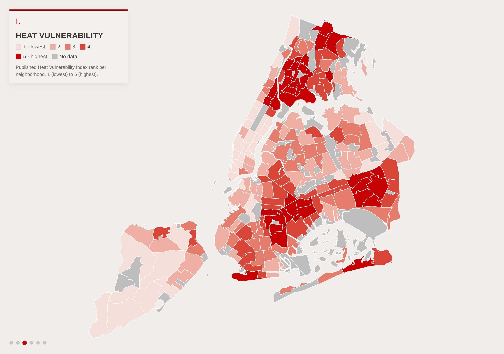
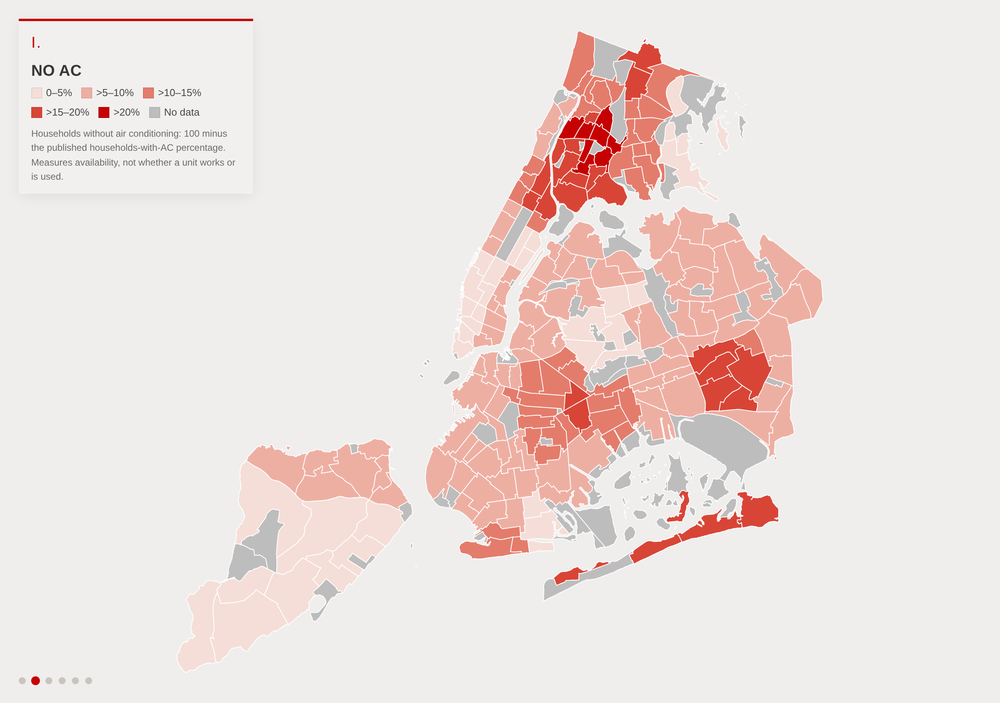
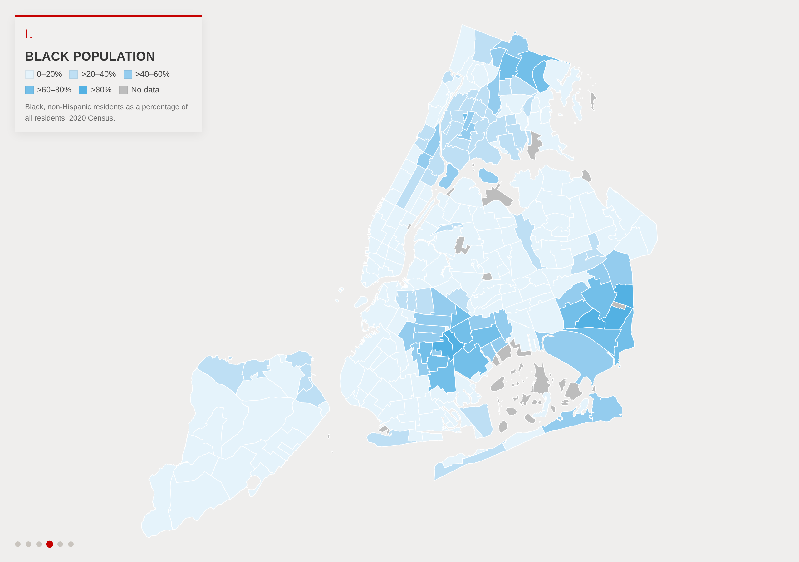
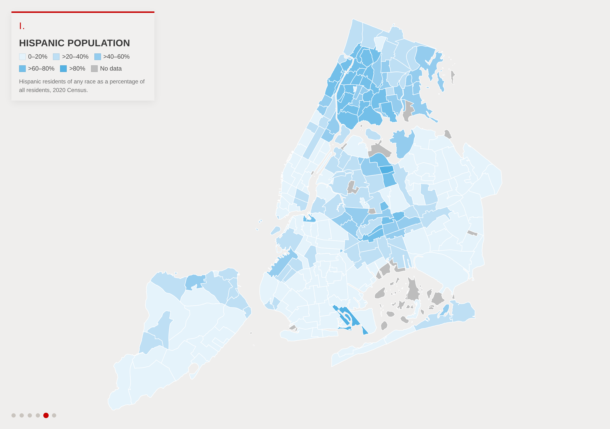

# 01 · Heat vulnerability, air conditioning and population by neighborhood

## Objective

Show, neighborhood by neighborhood, where New York City's published heat vulnerability is highest, where
households lack air conditioning, and how the Black and Hispanic populations are distributed across the
same geography, with borough and City Council district boundaries for orientation.

## Data

- Heat Vulnerability Index (HVI) rank, 1 (lowest) to 5 (highest), and percentage of households with air
  conditioning, per 2020 Neighborhood Tabulation Area (NTA). NYC Department of Health and Mental Hygiene.
- 2020 Census counts per NTA: total population (`Pop1`), Black non-Hispanic (`BNH`), Hispanic of any race
  (`Hsp1`). NYC Department of City Planning.
- Boundaries: 2020 NTAs, borough boundaries (release 26b, water excluded), City Council districts.

Full citations and retrieval dates: [`../inputs/README.md`](../inputs/README.md).

## Method

[`analysis.ipynb`](analysis.ipynb) joins the HVI table to the NTA boundaries one-to-one on the NTA code, then
joins the Census counts. The notebook is saved with its outputs and explains each step in place.

- `pct_households_no_ac = 100 − PCT_HOUSEHOLDS_AC`. This measures whether a household has air
  conditioning, not whether it works or is used.
- `pct_black_nh = BNH / Pop1 × 100` and `pct_hispanic = Hsp1 / Pop1 × 100`, rounded to one decimal;
  null where `Pop1 = 0`.
- Color bins: HVI uses its five published ranks. No AC uses breakpoints at 5, 10, 15 and 20 percentage
  points; Census shares at 20, 40, 60 and 80. Bins are upper-inclusive (a value above a breakpoint enters
  the next bin). These are display intervals, not thresholds with any epidemiological meaning. Missing
  values are gray and never mean zero.
- Display polygons are the simplified geometry in [`../geometry/`](../geometry/README.md), swapped in by
  feature ID after all values are computed.

The HVI itself is DOHMH's composite of five inputs: surface temperature, green space, home air
conditioning, median income and the share of residents who are Black. The department describes the
score as the sum of those factors assigned to quintiles from 1 (lowest risk) to 5 (highest risk)
(NYC Open Data, [Heat Vulnerability Index Rankings](https://data.cityofnewyork.us/d/4mhf-duep), and the
[indicator description](https://a816-dohbesp.nyc.gov/IndicatorPublic/data-explorer/climate/?id=2411#display=summary);
both cited in `layers.json`). The pinned file carries all five factor columns next to the rank. Two
consequences for reading these layers: the No AC and HVI layers are not independent measures, and the
Black-population layer is partly built into the index.

## Results

| | |
|---|---|
|  |  |
|  |  |

- 197 of 262 NTAs carry an HVI rank: 37, 40, 40, 40 and 40 neighborhoods at ranks 1 through 5, the
  near-equal fifths expected from a quintile score. The 65 unscored NTAs are parks, airports, cemeteries
  and other areas DOHMH does not score; 16 have zero population.
- Households without air conditioning range from 1.6% to 24.2% of a neighborhood (median 8.1%). Eight
  neighborhoods exceed 20%, all in the Bronx. The mean share rises with HVI rank: 5.1%, 6.7%, 8.2%,
  10.4% and 16.3% at ranks 1 through 5.
- Population composition by HVI rank, population-weighted: Black non-Hispanic residents are 4.7% of the
  population in rank-1 neighborhoods and 47.4% in rank-5 neighborhoods; Hispanic residents are 14.4% and
  35.6%. Each rank holds between 1.58 and 1.90 million residents.

These are descriptive co-locations and nothing here establishes a causal relationship. Because the share
of Black residents is one of the HVI's inputs, the rise in that share across ranks is partly by
construction; Hispanic share is not an input.

## Files

| File | Content |
|---|---|
| `analysis.ipynb` | Executed notebook: builds everything below from `../inputs/` and `../geometry/`, with notes at each step |
| `data/neighborhoods.geojson` | 262 NTAs with values and color fields for all four layers |
| `data/neighborhood_values.csv` | Same attributes without geometry |
| `data/boroughs.geojson`, `data/council_districts.geojson` | Outline layers |
| `data/layers.json` | Layer definitions: value and color fields, breakpoints, ramps, notes, sources |
| `figures/` | One rendering per layer, plus boroughs and council districts |
