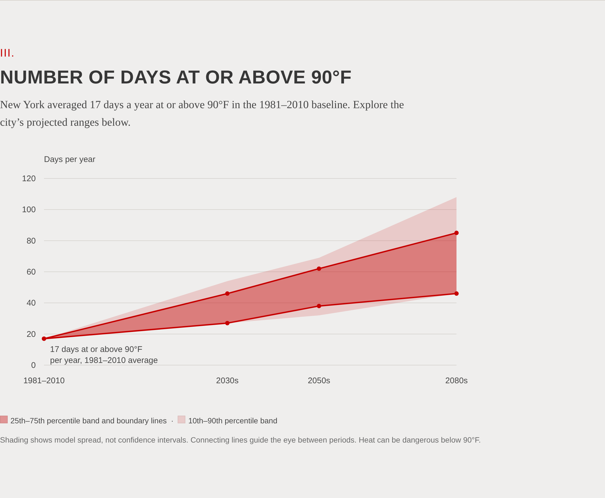

# 03 · Days at or above 90°F

## Objective

Show how many days per year New York City has reached a maximum temperature of 90°F or more in the
observed 1981–2010 baseline, and the range of days the city's official climate projections give for the
2030s, 2050s and 2080s.

## Data

New York City Panel on Climate Change (NPCC) projections published by the Mayor's Office of Climate and
Environmental Justice as "New York City Climate Projections: Extreme Events and Sea Level Rise" (NYC Open
Data 38ps-fnsg). Column used: "Number of days/year with maximum temperature at or above 90°F." The
dataset describes its projections as based on the CMIP6 models and SSP scenarios used for the IPCC Sixth
Assessment Report. Pinned copy: [`../inputs/npcc_extreme_events_projections.csv`](../inputs/README.md).

## Method

`build.py` reads the baseline row and the 10th, 25th, 75th and 90th percentile rows for each period,
checks that the percentiles are ordered, and writes `data/days_at_or_above_90f.json` and `.csv`. The
source publishes no median or central estimate, so none is drawn. The chart places periods at 1995, 2035,
2055 and 2085 on the horizontal axis and connects them with straight segments as a visual guide; the
segments are not annual predictions. The 25th and 75th percentiles are drawn as lines with the 25th–75th
range shaded darker and the 10th–90th range lighter.

## Results

| Period | 10th | 25th | 75th | 90th |
|---|---:|---:|---:|---:|
| Baseline, observed 1981–2010 | 17 | 17 | 17 | 17 |
| 2030s | 27 | 27 | 46 | 54 |
| 2050s | 32 | 38 | 62 | 69 |
| 2080s | 46 | 46 | 85 | 108 |

Days per year. The baseline row repeats the single observed value so a plotted range can begin from it.

## Scope

Percentile ranges describe the spread across models and scenarios in the NPCC ensemble, not statistical
confidence intervals. The 90°F threshold is the one this chart reports; heat causes illness and death at
lower temperatures as well.

## Files

| File | Content |
|---|---|
| `build.py` | Extracts the series and writes the data files |
| `data/days_at_or_above_90f.json`, `data/days_at_or_above_90f.csv` | Baseline and percentile series |
| `figures/days_at_or_above_90f.png` | Rendering |
