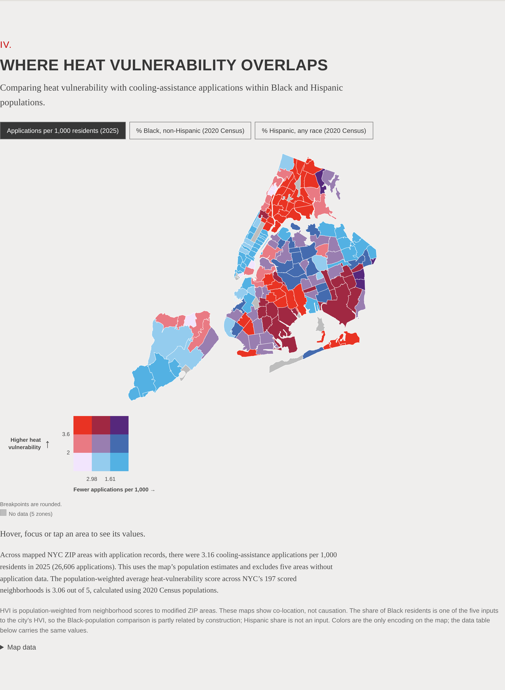
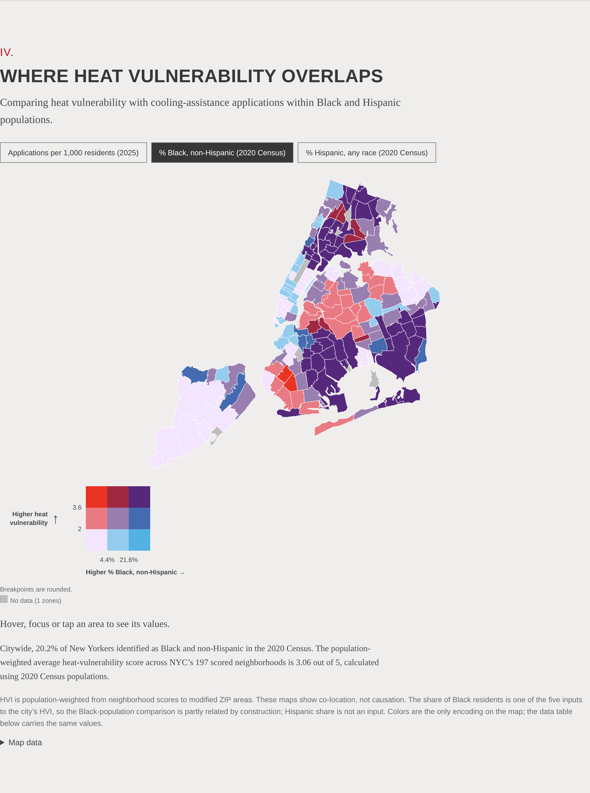
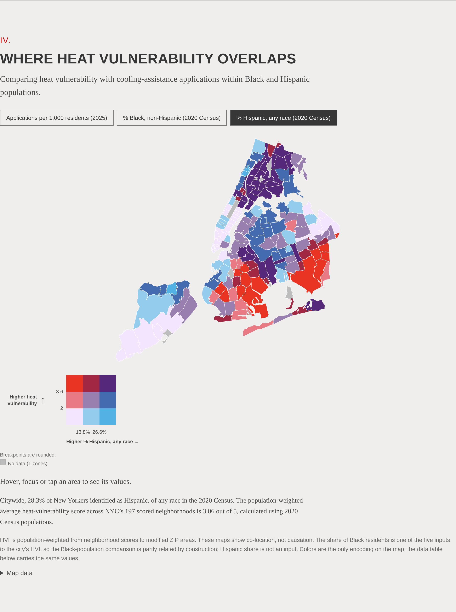
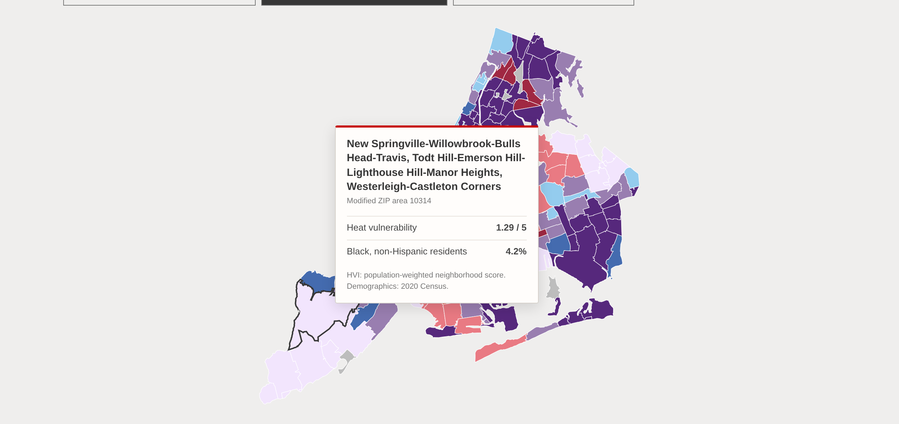

# 04 · Where heat vulnerability overlaps

## Objective

Compare heat vulnerability with three other quantities across New York City's modified ZIP code areas:
applications to the city's Cooling Assistance program in 2025, the share of residents who are Black and
non-Hispanic, and the share who are Hispanic of any race. Each comparison is a bivariate map: color
encodes the heat-vulnerability tercile and the comparison variable's tercile at once.

## Data

- Cooling Assistance applications (approved plus denied) by ZIP code, 2025 season, NYC Department of
  Social Services (DSS), obtained by The Margin. Aggregated to modified ZIP code areas (MODZCTA) by
  `aggregate_dss.ipynb`; the aggregated counts are [`../inputs/dss_applications_2025_by_modzcta.csv`](../inputs/README.md).
- Heat Vulnerability Index rank per 2020 NTA, NYC Department of Health and Mental Hygiene.
- 2020 Census tract counts (`Pop1`, `BNH`, `Hsp1`), NYC Department of City Planning.
- Boundaries and crosswalks: MODZCTA polygons with population estimates (`pop_est`, which the dataset
  describes as DOHMH estimates aggregated from 2018 ACS 5-year ZCTA populations), 2020 census tracts
  carrying their NTA code, and the DOHMH ZCTA-to-MODZCTA crosswalk.

## Method

The HVI is published by neighborhood (NTA) and the applications by ZIP code, and the two geographies do
not nest. Both are brought to MODZCTA, the health department's standard geography for ZIP-keyed data.

1. **Applications to MODZCTA** ([`aggregate_dss.ipynb`](aggregate_dss.ipynb)). ZIP rows are summed where a ZIP appears under more
   than one borough, approved and denied counts are added, and each ZIP is mapped to its MODZCTA with the
   DOHMH crosswalk plus one addition (11249 → 11211, per the MODZCTA dataset's own label). Counts only
   aggregate upward; no ZIP total is split. The sheets' grand totals give 26,622 applications; 26,621 sit on
   rows with a five-digit ZIP label and one denial sits on a row with no ZIP label and cannot be placed. Of the
   26,621, 26,606 map to 173 areas; 15 applications carry 13 ZIP labels with no MODZCTA (mostly ZIPs outside New
   York City or PO-box ZIPs, a few not matching any assigned ZIP code) and are listed in
   `inputs/dss_applications_2025_unmatched_zips.csv`. The full reconciliation is in
   `inputs/dss_applications_2025_totals.json`.
2. **HVI to MODZCTA** ([`analysis.ipynb`](analysis.ipynb)). 2020 census tracts nest exactly in 2020 NTAs, so each tract inherits
   its NTA's HVI rank. Tracts do not nest in MODZCTA, so each tract is split among the areas it overlaps by
   areal interpolation: the two layers are overlaid in a projected coordinate system (EPSG:2263, New
   York–Long Island State Plane) and each piece of a tract carries the fraction of the tract's area it
   covers, so a tract that straddles a boundary contributes to both sides in proportion to area. MODZCTA
   99999, the dataset's zero-population pseudo-area for parks, cemeteries and airports, is excluded as a
   target, and each tract's weights are renormalised to sum to one over its land inside residential areas,
   so the excluded parkland and the 4.3 square miles of waterfront that the MODZCTA layer does not cover
   receive no residents. A tract whose overlap with residential areas is below 1% of its area touches them
   only through digitising slivers and is treated as outside every area. An area's `hvi_popwtd` is the mean
   of its tract pieces' ranks weighted by each piece's share of 2020 tract population, over pieces with a
   rank and non-zero population: 2,240 of 2,325 tracts, 99.91% of residents. The 85 others are 71 tracts in
   unscored NTAs, 1 ranked tract outside every residential area and 13 ranked tracts with zero population.
   In all, 11 tracts lie outside every residential area, with 173 residents (Central Park, Crotona Park,
   Great Kills Park and Governors Island). 720 tracts are split between two or more areas; relative to
   assigning each tract whole to the area holding most of it, the split moves 624,056 residents (7.1%).
   The remaining approximation is uniform density within a tract.
3. **Census shares.** Tract counts are summed within each MODZCTA over the tract pieces of step 2, each
   carrying its area share of the tract's counts; `pct_black_nh` and `pct_hispanic` are those sums as
   percentages of the area's interpolated population (`pop_2020`), rounded to one decimal. Summed over all
   areas, `pop_2020` equals the city's tract population less the 173 residents outside every area.
4. **Rate.** `apps_1k = applications_2025 / pop_est × 1000`, using the MODZCTA dataset's population estimate.
   That estimate dates from 2018 ACS data, so the rate pairs 2025 applications with an earlier population.
5. **Terciles.** Each variable is cut at its own 1/3 and 2/3 quantiles over non-null areas (NumPy linear
   interpolation), with right-inclusive bins that include the minimum. The application tercile is
   reversed so that fewer applications sit to the right of the legend. Color is `palette[hvi_tercile]
   [comparison_tercile]`; an area with a null on either axis is gray.
6. **Citywide benchmarks.** Population shares from the Census NYC total; the HVI benchmark is
   `Σ(NTA rank × NTA population) / population of scored NTAs`; the application benchmark is
   `Σ applications / Σ pop_est × 1000` over areas with application records. Aggregates of counts, never
   averages of area percentages.

Exact tercile edges are in `data/legend.json`: HVI 1.000 | 2.004 | 3.599 | 5.000; applications per 1,000
0.11 | 1.61 | 2.98 | 8.91; % Black 0.1 | 4.4 | 21.6 | 84.1; % Hispanic 3.3 | 13.8 | 26.6 | 75.9.

## Results

| | |
|---|---|
|  |  |
|  |  |

Counts of the 178 areas by heat-vulnerability tercile (rows) and comparison tercile (columns). The
right-hand column is the direction the legend reads as "more": fewer applications, higher % Black,
higher % Hispanic.

| HVI tercile | Applications: more · mid · fewer | % Black: low · mid · high | % Hispanic: low · mid · high |
|---|---|---|---|
| High (> 3.599) | 38 · 18 · 3 | 2 · 7 · 50 | 13 · 15 · 31 |
| Middle | 15 · 26 · 17 | 23 · 28 · 8 | 9 · 25 · 25 |
| Low (≤ 2.004) | 5 · 13 · 38 | 34 · 25 · 0 | 38 · 18 · 3 |

Areas without a class: 5 for applications (no application record, including the zero-population
pseudo-area), 1 each for the Census shares.

- **Applications rise with heat vulnerability.** Applications per 1,000 residents, summing counts and
  populations over the areas with application records in each HVI tercile, are 1.46 in the low tercile,
  2.65 in the middle and 4.61 in the high. Only 3 of the 59 high-vulnerability areas fall in the fewest-applications tercile; 38 of the 56
  low-vulnerability areas with records do.
- **Black residents are concentrated in the high-vulnerability tercile.** 50 of 59 high-HVI areas are in
  the top tercile for % Black; none of the 59 low-HVI areas is. Summing the interpolated 2020 Census tract
  counts within each tercile, Black non-Hispanic residents are 5.0% of the low tercile's population, 9.0%
  of the middle and 39.8% of the high, against 20.2% citywide.
- **Hispanic residents are more evenly spread.** 31 of 59 high-HVI areas are in the top % Hispanic
  tercile; the same sums give 16.0% (low), 29.5% (middle) and 34.7% (high), against 28.3% citywide.
- **Sensitivity to the crosswalk.** Assigning each tract whole to the area containing its representative
  point, instead of splitting it by area, changes the HVI tercile of 12 areas, the % Black tercile of 4
  and the % Hispanic tercile of 3, and leaves the application classes unchanged; the largest differences
  in a single area are 0.46 in `hvi_popwtd` and 7.7 points in % Black (area 10464). Under whole-tract
  assignment 18 areas tie at an HVI of exactly 2.0, which puts 69 areas in the low tercile and 49 in the
  middle; area weighting breaks the ties and gives 59 in each.
- Citywide benchmarks: 3.16 applications per 1,000 residents across the 173 areas with records
  (26,606 applications, 8,424,783 residents); population-weighted mean HVI 3.06 across 197 scored
  neighborhoods.

## Scope

`hvi_popwtd` is a derived, population-weighted mean of an ordinal neighborhood index; it is not a
published ZIP-level score, and the page labels it as population-weighted wherever it appears. The maps
show where two quantities co-occur and do not establish causation or anything about program decisions.
The share of Black residents is one of the five inputs to the city's HVI (surface temperature, green space,
air conditioning access, median income, Black population), so the Black-population comparison is partly
related by construction; Hispanic share is not an input. Applications per 1,000 residents uses all
residents as the denominator, not eligible households, and by itself does not measure unmet need. Areas
without application records are gray, not zero.

## Files

| File | Content |
|---|---|
| `aggregate_dss.ipynb` | Executed notebook: DSS workbook → `inputs/dss_applications_2025_by_modzcta.csv` (rerunning requires the workbook) |
| `analysis.ipynb` | Executed notebook: crosswalk, Census sums, terciles, colors, benchmarks → `data/`, with cross-tabulations at the end |
| `data/hvi_by_modzcta.csv` | Population-weighted HVI, contributing neighborhoods, interpolated 2020 population and Census shares per area |
| `data/modzcta_bivariate.geojson`, `data/map_values.csv` | 178 areas with all values, classes and colors |
| `data/legend.json` | Palette, exact tercile edges, class rule, counts per comparison |
| `data/citywide_context.json` | Citywide benchmarks and crosswalk coverage statistics |
| `data/applications_by_hvi_tercile.csv`, `data/composition_by_hvi_tercile.csv` | The sums behind the by-tercile rates and population shares in Results |
| `figures/` | One rendering per comparison and a hover-state example |
