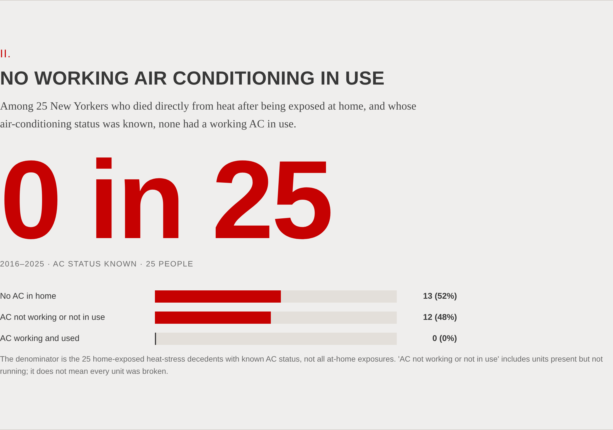

# NYC heat analysis

Data analysis behind The Margin's reporting on heat, air conditioning and cooling assistance in New York
City. This repository holds the four published visualizations, the data they draw, the code that produces
that data from public sources, and a description of each method and its limits, so the results can be
checked and reproduced.

`index.html` renders all four visualizations from the data in this repository. Open it directly in a
browser or serve the folder with `python3 -m http.server`.

## Objective

Describe, with the city's own published data, (1) where heat vulnerability and lack of home air
conditioning are concentrated across New York City's neighborhoods and how that geography relates to
the distribution of Black and Hispanic residents; (2) the air-conditioning status of residents who died of
heat stress after exposure at home; (3) how many days at or above 90°F the city has had and is projected
to have; and (4) how heat vulnerability co-occurs with applications to the city's Cooling Assistance
program and with population composition at the ZIP-code-area level.

## Approach

Every value is computed by a script in this repository from pinned copies of public source files
([`inputs/`](inputs/README.md)); the one non-public input, DSS application counts by ZIP code, ships as
aggregated 2025 totals per modified ZIP code area. Each visualization has its own directory with a README
stating its objective, data, method, results and scope, a `build.py`, the data it produces, and rendered
figures. Map polygons are simplified for display only ([`geometry/`](geometry/README.md)); all attributes
are computed from full-resolution sources. The page computes nothing: it formats and draws the values in
the data files.

| Directory | Visualization |
|---|---|
| [`01_heat_vulnerability_map/`](01_heat_vulnerability_map/) | Neighborhood map: heat vulnerability, households without AC, Black and Hispanic population shares, borough and council outlines |
| [`02_no_working_ac/`](02_no_working_ac/) | AC status among heat-stress decedents exposed at home, 2016–2025 |
| [`03_days_at_or_above_90f/`](03_days_at_or_above_90f/) | Observed baseline and projected days per year at or above 90°F |
| [`04_heat_vulnerability_overlap/`](04_heat_vulnerability_overlap/) | Bivariate maps: heat vulnerability against applications per 1,000 residents, % Black and % Hispanic |

## Results

### 1. Heat vulnerability by neighborhood

[](01_heat_vulnerability_map/)

197 of 262 neighborhoods carry a Heat Vulnerability Index rank; the highest ranks cluster in the South
Bronx, central Brooklyn and southeast Queens. Households without air conditioning range from 1.6% to
24.2% by neighborhood, and the mean share rises from 5.1% in rank-1 neighborhoods to 16.3% in rank-5
neighborhoods (household AC is one of the index's inputs). Black non-Hispanic residents make up 4.7% of
the population of rank-1 neighborhoods and 47.4% of rank-5 neighborhoods; Hispanic residents 14.4% and
35.6%. [Details](01_heat_vulnerability_map/README.md).

### 2. No working air conditioning in use

[](02_no_working_ac/)

Of 25 New York City residents who died of heat stress after exposure at home and whose AC status was
known (2016–2025), 13 had no air conditioner, 12 had one that was not working or not in use, and none had
a working unit in use. [Details](02_no_working_ac/README.md).

### 3. Days at or above 90°F

[](03_days_at_or_above_90f/)

The city averaged 17 days per year at or above 90°F in 1981–2010. The NPCC model ensemble gives 27–46 days
for the 2030s, 38–62 for the 2050s and 46–85 for the 2080s at the 25th–75th percentiles, and 46–108 for
the 2080s at the 10th–90th. [Details](03_days_at_or_above_90f/README.md).

### 4. Where heat vulnerability overlaps

[](04_heat_vulnerability_overlap/)

Across 178 modified ZIP code areas, applications to Cooling Assistance in 2025 rise with heat
vulnerability: 1.61 applications per 1,000 residents in the lowest heat-vulnerability tercile, 2.70 in
the middle and 4.60 in the highest. 49 of the 59 highest-vulnerability areas are in the top tercile for
share of Black non-Hispanic residents (1 of 69 lowest-vulnerability areas is); 29 of 59 are in the top
tercile for share of Hispanic residents. [Details](04_heat_vulnerability_overlap/README.md).

These results describe where quantities co-occur. Race and ethnicity are not inputs to the Heat
Vulnerability Index, and none of the comparisons establish causation.

## Data sources

| Publisher | Dataset | Used in |
|---|---|---|
| NYC Department of Health and Mental Hygiene | [Heat Vulnerability Index by 2020 NTA](https://a816-dohbesp.nyc.gov/IndicatorPublic/data-features/hvi/) | 01, 04 |
| NYC Department of Health and Mental Hygiene | [2026 Heat-Related Mortality Report](https://a816-dohbesp.nyc.gov/IndicatorPublic/data-features/heat-report/), Table 2 | 02 |
| NYC Department of Health and Mental Hygiene | [ZCTA to MODZCTA crosswalk](https://github.com/nychealth/coronavirus-data) | 04 |
| NYC Department of City Planning | [Decennial Census data](https://www.nyc.gov/content/planning/pages/resources/datasets/decennial-census), 2020 Census Data core geographies workbook ([zip](https://s-media.nyc.gov/agencies/dcp/assets/files/zip/data-tools/population/census-2020/2020-census-data.zip)) | 01, 04 |
| NYC Department of City Planning | [Borough Boundaries, water areas excluded, 26b](https://data.cityofnewyork.us/d/gthc-hcne) | 01 |
| NYC Open Data | [2020 Neighborhood Tabulation Areas](https://data.cityofnewyork.us/d/9nt8-h7nd) | 01 |
| NYC Open Data | [2020 Census Tracts](https://data.cityofnewyork.us/d/63ge-mke6) | 04 |
| NYC Open Data | [Modified Zip Code Tabulation Areas](https://data.cityofnewyork.us/d/pri4-ifjk) | 04 |
| NYC Open Data | [City Council Districts](https://data.cityofnewyork.us/d/872g-cjhh) | 01 |
| Mayor's Office of Climate and Environmental Justice / NPCC | [NYC Climate Projections: Extreme Events and Sea Level Rise](https://data.cityofnewyork.us/d/38ps-fnsg) | 03 |
| NYC Department of Social Services | Cooling Assistance applications by ZIP code, 2025 season (obtained by The Margin; aggregated counts in `inputs/`) | 04 |

Retrieval dates and file-level notes: [`inputs/README.md`](inputs/README.md).

## Reproducing

Python 3.11 or later with `geopandas`, `pandas`, `numpy`, `shapely` and `openpyxl`; Playwright for Python with
Chromium for the figures.

```bash
python3 01_heat_vulnerability_map/build.py
python3 02_no_working_ac/build.py
python3 03_days_at_or_above_90f/build.py
python3 04_heat_vulnerability_overlap/build.py     # reads inputs/dss_applications_2025_by_modzcta.csv
python3 build_site.py                              # bundles */data into site/bundle.js for index.html
python3 figures.py                                 # renders */figures/*.png from index.html
python3 verify.py                                  # bundle, counts, colors and page copy agree
```

`04_heat_vulnerability_overlap/aggregate_dss.py` regenerates the aggregated application counts from the
DSS workbook, which is not included here. Every build script asserts the counts it publishes.

## Layout

```
index.html, site/        The page: styles, script, bundled data
inputs/                  Pinned source files with a README of links and retrieval dates
geometry/                Simplified display polygons and their method
01_… 02_… 03_… 04_…      One directory per visualization: README, build.py, data/, figures/
common.py                Shared citations, palettes and writers used by the build scripts
build_site.py, figures.py, verify.py
```
